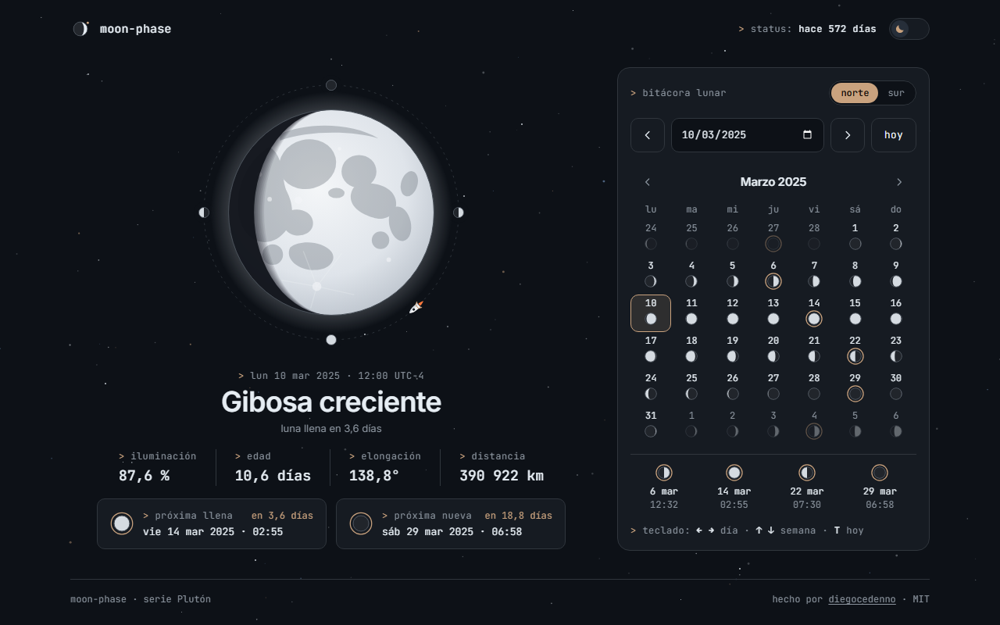

# moon-phase

> The Moon's phase for today or any date, computed in your browser with a real astronomical algorithm — plus a monthly calendar and the next full and new moons.
>
> La fase de la Luna de hoy o de cualquier fecha, calculada en tu navegador con un algoritmo astronómico de verdad, con calendario mensual y las próximas lunas llena y nueva.

**[Live demo · Demo en vivo →](https://diegocedenno.github.io/moon-phase/)**

[](https://diegocedenno.github.io/moon-phase/)

**[English](#english)** · **[Español](#español)**

---

## English

### What it does

- Shows the Moon for the selected date as a large SVG: lit fraction, age in days, elongation, distance and the phase name.
- Pick a date with the native date field, step day by day, jump back to today, or click any day in the monthly calendar. The phase glides from one date to the next.
- The calendar draws every day's Moon, rings the days of new moon, quarters and full moon, and lists their exact local times.
- Next full moon and next new moon, with local date, time and a countdown in days.
- Northern / southern hemisphere view (the Moon is drawn upside down in the south). The choice is remembered (`localStorage`).

### What makes it technically interesting

- **A real ephemeris, not a 29.53-day modulo.** Solar and lunar ecliptic longitudes come from Meeus' *Astronomical Algorithms* series (59 periodic terms for the Moon's longitude and distance, 14 for its latitude, plus the Venus, Jupiter and flattening corrections), evaluated in dynamical time with a ΔT polynomial. The phase is the elongation Moon − Sun; the lit fraction comes from the phase angle, `k = (1 + cos i) / 2`.
- **Phase instants by root finding.** New and full moons and quarters are where the elongation crosses 0°, 90°, 180° and 270°; a Newton iteration with the mean synodic rate converges in a handful of steps. Checked against 18 published instants between 1969 and 2026: every one lands within 1.5 minutes.
- **Principal phases are instants, not day ranges.** A day is labelled "full moon" only if the exact instant falls inside that local day; everything else is named by quadrant.
- **The shadow is one path made of two arcs.** Half the limb plus the terminator, an elliptical arc whose semi-axis is `R·|cos phase|`. The same function draws the big Moon, the 42 calendar cells and the icons. A few translucent copies, slightly ahead of the terminator, fake a penumbra without SVG filters.
- **Animated by interpolating the phase.** `requestAnimationFrame` eases the phase along the shortest way round the cycle; the rocket on the dashed dial marks where the Moon is in its synodic month. With `prefers-reduced-motion` the loop never runs: the Moon jumps to its final state with an opacity fade.
- **Accessible calendar.** Each day is a real button with a full spoken label; the grid has a single tab stop and is navigated with the arrow keys; changes are announced through a live region.
- **Zero dependencies, zero build, zero network.** Plain HTML, CSS and JavaScript. Fonts are bundled.

### Keyboard

| Key | Action |
| --- | --- |
| `←` `→` | Previous / next day |
| `↑` `↓` | One week back / forward |
| `T` | Today |
| `Tab` | Move through the controls; inside the calendar the arrows move the focus too |

### Run it

Double-click `index.html`. That is all — there is no build step and no server.
It also works as-is on GitHub Pages.

The astronomy lives in `js/astro.js` with no DOM access, so it can be checked from Node:

```bash
node -e "global.window={}; require('./js/astro.js'); console.log(new Date(window.MoonPhase.astro.nextPhase(Date.UTC(2025,2,1), 180)).toISOString())"
# 2025-03-14T06:55:14.…Z  (full moon, published as 06:55 UTC)
```

### Notes

- Times are shown in your device's time zone. Today is computed for the current moment; any other date for its local noon.
- Positions are geocentric: no parallax, so the lit fraction can differ slightly from what a specific observer sees.

### License

[MIT](LICENSE) © Diego Cedeño. Inter and JetBrains Mono are bundled under the [SIL Open Font License](assets/fonts/).

---

## Español

### Qué hace

- Muestra la Luna de la fecha elegida en un SVG grande: fracción iluminada, edad en días, elongación, distancia y nombre de la fase.
- Elige una fecha con el campo nativo, avanza día a día, vuelve a hoy o haz clic en cualquier día del calendario mensual. La fase se desliza de una fecha a la siguiente.
- El calendario dibuja la Luna de cada día, marca con un anillo los días de luna nueva, cuartos y luna llena, y lista sus horas locales exactas.
- Próxima luna llena y próxima luna nueva, con fecha y hora local y una cuenta atrás en días.
- Vista desde el hemisferio norte o el sur (en el sur la Luna se dibuja invertida). La elección se recuerda (`localStorage`).

### Qué lo hace interesante técnicamente

- **Efemérides de verdad, no un módulo de 29,53 días.** Las longitudes eclípticas del Sol y de la Luna salen de las series de *Astronomical Algorithms* de Meeus (59 términos periódicos para la longitud y la distancia de la Luna, 14 para su latitud, más las correcciones de Venus, Júpiter y el achatamiento terrestre), evaluadas en tiempo dinámico con un polinomio de ΔT. La fase es la elongación Luna − Sol; la fracción iluminada sale del ángulo de fase, `k = (1 + cos i) / 2`.
- **Instantes de fase por búsqueda de raíces.** Las lunas nuevas, llenas y los cuartos son los cruces de la elongación por 0°, 90°, 180° y 270°; una iteración de Newton con la velocidad sinódica media converge en pocos pasos. Comprobado contra 18 instantes publicados entre 1969 y 2026: todos caen a menos de 1,5 minutos.
- **Las fases principales son instantes, no rangos de días.** Un día se llama «luna llena» solo si el instante exacto cae dentro de ese día local; el resto se nombra por cuadrante.
- **La sombra es un único path de dos arcos.** Medio limbo más el terminador, un arco elíptico de semieje `R·|cos fase|`. La misma función dibuja la Luna grande, las 42 casillas del calendario y los iconos. Unas copias translúcidas, algo adelantadas al terminador, simulan la penumbra sin filtros SVG.
- **Animación interpolando la fase.** `requestAnimationFrame` suaviza la fase por el camino más corto del ciclo; el cohete del dial punteado marca en qué punto del mes sinódico está la Luna. Con `prefers-reduced-motion` el bucle no arranca: la Luna salta a su estado final con un fundido de opacidad.
- **Calendario accesible.** Cada día es un botón real con una etiqueta hablada completa; la rejilla tiene un solo punto de tabulación y se recorre con las flechas; los cambios se anuncian en una región viva.
- **Cero dependencias, cero build, cero red.** HTML, CSS y JavaScript sin más. Las fuentes van incluidas.

### Teclado

| Tecla | Acción |
| --- | --- |
| `←` `→` | Día anterior / siguiente |
| `↑` `↓` | Una semana atrás / adelante |
| `T` | Hoy |
| `Tab` | Recorre los controles; dentro del calendario las flechas mueven también el foco |

### Cómo correrlo

Doble clic en `index.html`. Nada más: no hay build ni servidor.
También funciona tal cual en GitHub Pages.

La astronomía vive en `js/astro.js`, sin acceso al DOM, así que se puede comprobar desde Node:

```bash
node -e "global.window={}; require('./js/astro.js'); console.log(new Date(window.MoonPhase.astro.nextPhase(Date.UTC(2025,2,1), 180)).toISOString())"
# 2025-03-14T06:55:14.…Z  (luna llena, publicada a las 06:55 UTC)
```

### Notas

- Las horas se muestran en la zona horaria de tu dispositivo. Hoy se calcula para el momento actual; cualquier otra fecha, para su mediodía local.
- Las posiciones son geocéntricas: sin paralaje, así que la fracción iluminada puede diferir ligeramente de la que ve un observador concreto.

### Licencia

[MIT](LICENSE) © Diego Cedeño. Inter y JetBrains Mono se incluyen bajo la [SIL Open Font License](assets/fonts/).
